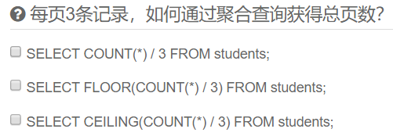

# 04 查询数据

在关系数据库中，最常用的操作就是查询。

## 准备数据

为了便于讲解和练习，我们先准备好了一个`students`表和一个`classes`表，它们的结构和数据如下：

`students`表存储了学生信息：

| id   | class_id | name | gender | score |
| :--- | :------- | :--- | :----- | :---- |
| 1    | 1        | 小明 | M      | 90    |
| 2    | 1        | 小红 | F      | 95    |
| 3    | 1        | 小军 | M      | 88    |
| 4    | 1        | 小米 | F      | 73    |
| 5    | 2        | 小白 | F      | 81    |
| 6    | 2        | 小兵 | M      | 55    |
| 7    | 2        | 小林 | M      | 85    |
| 8    | 3        | 小新 | F      | 91    |
| 9    | 3        | 小王 | M      | 89    |
| 10   | 3        | 小丽 | F      | 85    |

`classes`表存储了班级信息：

| id   | name |
| :--- | :--- |
| 1    | 一班 |
| 2    | 二班 |
| 3    | 三班 |
| 4    | 四班 |

请注意，和`MySQL`的持久化存储不同的是，由于我们使用的是[AlaSQL](http://alasql.org/)内存数据库，两张表的数据在页面加载时导入，并且只存在于浏览器的内存中，因此，刷新页面后，数据会重置为上述初始值。

## MySQL

如果你想用MySQL练习，可以[下载](https://raw.githubusercontent.com/michaelliao/learn-sql/master/mysql/init-test-data.sql)这个[SQL脚本](https://github.com/michaelliao/learn-sql/blob/master/mysql/init-test-data.sql)，然后在命令行运行：

```
$ mysql -u root -p < init-test-data.sql
```

就可以自动创建`test`数据库，并且在`test`数据库下创建`students`表和`classes`表，以及必要的初始化数据。

和内存数据库不同的是，对MySQL数据库做的所有修改，都会保存下来。如果你希望恢复到初始状态，可以再次运行该脚本。

## 基本查询

要查询数据库表的数据，我们使用如下的SQL语句：

```sql
SELECT * FROM <表名>
```

假设表名是`students`，要查询`students`表的所有行，我们用如下SQL语句：
```sql
-- 查询students表的所有数据
SELECT * FROM students;
```
| id   | class_id | name | gender | score |
| :--- | :------- | :--- | :----- | :---- |
| 1    | 1        | 小明 | M      | 90    |
| 2    | 1        | 小红 | F      | 95    |
| 3    | 1        | 小军 | M      | 88    |
| 4    | 1        | 小米 | F      | 73    |
| 5    | 2        | 小白 | F      | 81    |
| 6    | 2        | 小兵 | M      | 55    |
| 7    | 2        | 小林 | M      | 85    |
| 8    | 3        | 小新 | F      | 91    |
| 9    | 3        | 小王 | M      | 89    |
| 10   | 3        | 小丽 | F      | 88    |

使用`SELECT * FROM students`时，`SELECT`是关键字，表示将要执行一个查询，`*`表示“所有列”，`FROM`表示将要从哪个表查询，本例中是`students`表。

该SQL将查询出`students`表的所有数据。注意：查询结果也是一个二维表，它包含列名和每一行的数据。

要查询`classes`表的所有行，我们用如下SQL语句：
```sql
-- 查询classes表的所有数据
SELECT * FROM classes;
```
| id   | name |
| :--- | :--- |
| 1    | 一班 |
| 2    | 二班 |
| 3    | 三班 |
| 4    | 四班 |

运行上述SQL语句，观察查询结果。

`SELECT`语句其实并不要求一定要有`FROM`子句。我们来试试下面的`SELECT`语句：

```sql
-- 计算100+200
SELECT 100+200;
```

| 100 + 200 |
| :-------- |
| 300       |

上述查询会直接计算出表达式的结果。虽然`SELECT`可以用作计算，但它并不是SQL的强项。但是，不带`FROM`子句的`SELECT`语句有一个有用的用途，就是用来判断当前到数据库的连接是否有效。许多检测工具会执行一条`SELECT 1;`来测试数据库连接。

### 小结

- 使用SELECT查询的基本语句`SELECT * FROM <表名>`可以查询一个表的所有行和所有列的数据。
- SELECT查询的结果是一个二维表。

## 条件查询

使用`SELECT * FROM <表名>`可以查询到一张表的所有记录。但是，很多时候，我们并不希望获得所有记录，而是根据条件选择性地获取指定条件的记录，例如，查询分数在80分以上的学生记录。在一张表有数百万记录的情况下，获取所有记录不仅费时，还费内存和网络带宽。

SELECT语句可以通过`WHERE`条件来设定查询条件，查询结果是满足查询条件的记录。例如，要指定条件“分数在80分或以上的学生”，写成`WHERE`条件就是`SELECT * FROM students WHERE score >= 80`。

其中，`WHERE`关键字后面的`score >= 80`就是条件。`score`是列名，该列存储了学生的成绩，因此，`score >= 80`就筛选出了指定条件的记录：

```sql
-- 按条件查询students:
SELECT * FROM students WHERE score >= 80;
```

| id   | class_id | name | gender | score |
| :--- | :------- | :--- | :----- | :---- |
| 1    | 1        | 小明 | M      | 90    |
| 2    | 1        | 小红 | F      | 95    |
| 3    | 1        | 小军 | M      | 88    |
| 5    | 2        | 小白 | F      | 81    |
| 7    | 2        | 小林 | M      | 85    |
| 8    | 3        | 小新 | F      | 91    |
| 9    | 3        | 小王 | M      | 89    |
| 10   | 3        | 小丽 | F      | 88    |

因此，条件查询的语法就是：

```sql
SELECT * FROM <表名> WHERE <条件表达式>
```

条件表达式可以用`<条件1> AND <条件2>`表达满足条件1并且满足条件2。例如，符合条件“分数在80分或以上”，并且还符合条件“男生”，把这两个条件写出来：

- 条件1：根据score列的数据判断：`score >= 80`；
- 条件2：根据gender列的数据判断：`gender = 'M'`，注意`gender`列存储的是字符串，需要用单引号括起来。

就可以写出`WHERE`条件：`score >= 80 AND gender = 'M'`：

```sql
-- 按AND条件查询students:
SELECT * FROM students WHERE score >= 80 AND gender = 'M';
```

| id   | class_id | name | gender | score |
| :--- | :------- | :--- | :----- | :---- |
| 1    | 1        | 小明 | M      | 90    |
| 3    | 1        | 小军 | M      | 88    |
| 7    | 2        | 小林 | M      | 85    |
| 9    | 3        | 小王 | M      | 89    |

第二种条件是`<条件1> OR <条件2>`，表示满足条件1或者满足条件2。例如，把上述`AND`查询的两个条件改为`OR`，查询结果就是“分数在80分或以上”或者“男生”，满足任意之一的条件即选出该记录：

```sql
-- 按OR条件查询students:
SELECT * FROM students WHERE score >= 80 OR gender = 'M';
```

| id   | class_id | name | gender | score |
| :--- | :------- | :--- | :----- | :---- |
| 1    | 1        | 小明 | M      | 90    |
| 2    | 1        | 小红 | F      | 95    |
| 3    | 1        | 小军 | M      | 88    |
| 5    | 2        | 小白 | F      | 81    |
| 6    | 2        | 小兵 | M      | 55    |
| 7    | 2        | 小林 | M      | 85    |
| 8    | 3        | 小新 | F      | 91    |
| 9    | 3        | 小王 | M      | 89    |
| 10   | 3        | 小丽 | F      | 88    |

很显然`OR`条件要比`AND`条件宽松，返回的符合条件的记录也更多。

第三种条件是`NOT <条件>`，表示“不符合该条件”的记录。例如，写一个“不是2班的学生”这个条件，可以先写出“是2班的学生”：`class_id = 2`，再加上`NOT`：`NOT class_id = 2`：

```sql
-- 按NOT条件查询students:
SELECT * FROM students WHERE NOT class_id = 2;
```

| id   | class_id | name | gender | score |
| :--- | :------- | :--- | :----- | :---- |
| 1    | 1        | 小明 | M      | 90    |
| 2    | 1        | 小红 | F      | 95    |
| 3    | 1        | 小军 | M      | 88    |
| 4    | 1        | 小米 | F      | 73    |
| 8    | 3        | 小新 | F      | 91    |
| 9    | 3        | 小王 | M      | 89    |
| 10   | 3        | 小丽 | F      | 88    |

上述`NOT`条件`NOT class_id = 2`其实等价于`class_id <> 2`，因此，`NOT`查询不是很常用。

要组合三个或者更多的条件，就需要用小括号`()`表示如何进行条件运算。例如，编写一个复杂的条件：分数在80以下或者90以上，并且是男生：

```sql
-- 按多个条件查询students:
SELECT * FROM students WHERE (score < 80 OR score > 90) AND gender = 'M';
```

| id   | class_id | name | gender | score |
| :--- | :------- | :--- | :----- | :---- |
| 6    | 2        | 小兵 | M      | 55    |

如果不加括号，条件运算按照`NOT`、`AND`、`OR`的优先级进行，即`NOT`优先级最高，其次是`AND`，最后是`OR`。加上括号可以改变优先级。

### 常用的条件表达式

| 条件                 | 表达式举例1     | 表达式举例2      | 说明                                              |
| :------------------- | :-------------- | :--------------- | :------------------------------------------------ |
| 使用=判断相等        | score = 80      | name = 'abc'     | 字符串需要用单引号括起来                          |
| 使用>判断大于        | score > 80      | name > 'abc'     | 字符串比较根据ASCII码，中文字符比较根据数据库设置 |
| 使用>=判断大于或相等 | score >= 80     | name >= 'abc'    |                                                   |
| 使用<判断小于        | score < 80      | name <= 'abc'    |                                                   |
| 使用<=判断小于或相等 | score <= 80     | name <= 'abc'    |                                                   |
| 使用<>判断不相等     | score <> 80     | name <> 'abc'    |                                                   |
| 使用LIKE判断相似     | name LIKE 'ab%' | name LIKE '%bc%' | %表示任意字符，例如'ab%'将匹配'ab'，'abc'，'abcd' |

### 小结

通过`WHERE`条件查询，可以筛选出符合指定条件的记录，而不是整个表的所有记录。

## 投影查询

使用`SELECT * FROM <表名> WHERE <条件>`可以选出表中的若干条记录。我们注意到返回的二维表结构和原表是相同的，即结果集的所有列与原表的所有列都一一对应。

如果我们只希望返回某些列的数据，而不是所有列的数据，我们可以用`SELECT 列1, 列2, 列3 FROM ...`，让结果集仅包含指定列。这种操作称为投影查询。

例如，从`students`表中返回`id`、`score`和`name`这三列：

```sql
-- 使用投影查询
SELECT id, score, name FROM students;
```

| id   | score | name |
| :--- | :---- | :--- |
| 1    | 90    | 小明 |
| 2    | 95    | 小红 |
| 3    | 88    | 小军 |
| 4    | 73    | 小米 |
| 5    | 81    | 小白 |
| 6    | 55    | 小兵 |
| 7    | 85    | 小林 |
| 8    | 91    | 小新 |
| 9    | 89    | 小王 |
| 10   | 88    | 小丽 |

这样返回的结果集就只包含了我们指定的列，并且，结果集的列的顺序和原表可以不一样。

使用`SELECT 列1, 列2, 列3 FROM ...`时，还可以给每一列起个别名，这样，结果集的列名就可以与原表的列名不同。它的语法是`SELECT 列1 别名1, 列2 别名2, 列3 别名3 FROM ...`。

例如，以下`SELECT`语句将列名`score`重命名为`points`，而`id`和`name`列名保持不变：

```sql
-- 使用投影查询，并将列名重命名：
SELECT id, score points, name FROM students;
```

| id   | points | name |
| :--- | :----- | :--- |
| 1    | 90     | 小明 |
| 2    | 95     | 小红 |
| 3    | 88     | 小军 |
| 4    | 73     | 小米 |
| 5    | 81     | 小白 |
| 6    | 55     | 小兵 |
| 7    | 85     | 小林 |
| 8    | 91     | 小新 |
| 9    | 89     | 小王 |
| 10   | 88     | 小丽 |

投影查询同样可以接`WHERE`条件，实现复杂的查询：

```sql
-- 使用投影查询+WHERE条件：
SELECT id, score points, name FROM students WHERE gender = 'M';
id	points	name
1	90	小明
3	88	小军
6	55	小兵
7	85	小林
9	89	小王
```

### 小结

- 使用`SELECT *`表示查询表的所有列，使用`SELECT 列1, 列2, 列3`则可以仅返回指定列，这种操作称为投影。
- `SELECT`语句可以对结果集的列进行重命名。

## 排序

### 排序

我们使用SELECT查询时，细心的读者可能注意到，查询结果集通常是按照`id`排序的，也就是根据主键排序。这也是大部分数据库的做法。如果我们要根据其他条件排序怎么办？可以加上`ORDER BY`子句。例如按照成绩从低到高进行排序：

```sql
-- 按score从低到高
SELECT id, name, gender, score FROM students ORDER BY score;
```

| id   | name | gender | score |
| :--- | :--- | :----- | :---- |
| 6    | 小兵 | M      | 55    |
| 4    | 小米 | F      | 73    |
| 5    | 小白 | F      | 81    |
| 7    | 小林 | M      | 85    |
| 3    | 小军 | M      | 88    |
| 10   | 小丽 | F      | 88    |
| 9    | 小王 | M      | 89    |
| 1    | 小明 | M      | 90    |
| 8    | 小新 | F      | 91    |
| 2    | 小红 | F      | 95    |

如果要反过来，按照成绩从高到底排序，我们可以加上`DESC`表示“倒序”：

```sql
-- 按score从高到低
SELECT id, name, gender, score FROM students ORDER BY score DESC;
```

| id   | name | gender | score |
| :--- | :--- | :----- | :---- |
| 2    | 小红 | F      | 95    |
| 8    | 小新 | F      | 91    |
| 1    | 小明 | M      | 90    |
| 9    | 小王 | M      | 89    |
| 3    | 小军 | M      | 88    |
| 10   | 小丽 | F      | 88    |
| 7    | 小林 | M      | 85    |
| 5    | 小白 | F      | 81    |
| 4    | 小米 | F      | 73    |
| 6    | 小兵 | M      | 55    |

如果`score`列有相同的数据，要进一步排序，可以继续添加列名。例如，使用`ORDER BY score DESC, gender`表示先按`score`列倒序，如果有相同分数的，再按`gender`列排序：

```sql
-- 按score, gender排序:
SELECT id, name, gender, score FROM students ORDER BY score DESC, gender;
```

| id   | name | gender | score |
| :--- | :--- | :----- | :---- |
| 2    | 小红 | F      | 95    |
| 8    | 小新 | F      | 91    |
| 1    | 小明 | M      | 90    |
| 9    | 小王 | M      | 89    |
| 10   | 小丽 | F      | 88    |
| 3    | 小军 | M      | 88    |
| 7    | 小林 | M      | 85    |
| 5    | 小白 | F      | 81    |
| 4    | 小米 | F      | 73    |
| 6    | 小兵 | M      | 55    |

默认的排序规则是`ASC`：“升序”，即从小到大。`ASC`可以省略，即`ORDER BY score ASC`和`ORDER BY score`效果一样。

如果有`WHERE`子句，那么`ORDER BY`子句要放到`WHERE`子句后面。例如，查询一班的学生成绩，并按照倒序排序：

```sql
-- 带WHERE条件的ORDER BY:
SELECT id, name, gender, score
FROM students
WHERE class_id = 1
ORDER BY score DESC;
```

| id   | name | gender | score |
| :--- | :--- | :----- | :---- |
| 2    | 小红 | F      | 95    |
| 1    | 小明 | M      | 90    |
| 3    | 小军 | M      | 88    |
| 4    | 小米 | F      | 73    |

这样，结果集仅包含符合`WHERE`条件的记录，并按照`ORDER BY`的设定排序。

### 小结

- 使用`ORDER BY`可以对结果集进行排序；
- 可以对多列进行升序、倒序排序。

## 分页查询

使用SELECT查询时，如果结果集数据量很大，比如几万行数据，放在一个页面显示的话数据量太大，不如分页显示，每次显示100条。

要实现分页功能，实际上就是从结果集中显示第1~100条记录作为第1页，显示第101~200条记录作为第2页，以此类推。

因此，分页实际上就是从结果集中“截取”出第M~N条记录。这个查询可以通过`LIMIT  OFFSET `子句实现。我们先把所有学生按照成绩从高到低进行排序：

```sql
-- 按score从高到低
SELECT id, name, gender, score FROM students ORDER BY score DESC;
```

| id   | name | gender | score |
| :--- | :--- | :----- | :---- |
| 2    | 小红 | F      | 95    |
| 8    | 小新 | F      | 91    |
| 1    | 小明 | M      | 90    |
| 9    | 小王 | M      | 89    |
| 3    | 小军 | M      | 88    |
| 10   | 小丽 | F      | 88    |
| 7    | 小林 | M      | 85    |
| 5    | 小白 | F      | 81    |
| 4    | 小米 | F      | 73    |
| 6    | 小兵 | M      | 55    |

现在，我们把结果集分页，每页3条记录。要获取第1页的记录，可以使用`LIMIT 3 OFFSET 0`：

```sql
-- 查询第1页
SELECT id, name, gender, score
FROM students
ORDER BY score DESC
LIMIT 3 OFFSET 0;
```

| id   | name | gender | score |
| :--- | :--- | :----- | :---- |
| 2    | 小红 | F      | 95    |
| 8    | 小新 | F      | 91    |
| 1    | 小明 | M      | 90    |

上述查询`LIMIT 3 OFFSET 0`表示，对结果集从0号记录开始，最多取3条。注意SQL记录集的索引从0开始。

如果要查询第2页，那么我们只需要“跳过”头3条记录，也就是对结果集从3号记录开始查询，把`OFFSET`设定为3：

```sql
-- 查询第2页
SELECT id, name, gender, score
FROM students
ORDER BY score DESC
LIMIT 3 OFFSET 3;
```

| id   | name | gender | score |
| :--- | :--- | :----- | :---- |
| 9    | 小王 | M      | 89    |
| 3    | 小军 | M      | 88    |
| 10   | 小丽 | F      | 88    |

类似的，查询第3页的时候，`OFFSET`应该设定为6:

```sql
-- 查询第3页
SELECT id, name, gender, score
FROM students
ORDER BY score DESC
LIMIT 3 OFFSET 6;
```

| id   | name | gender | score |
| :--- | :--- | :----- | :---- |
| 7    | 小林 | M      | 85    |
| 5    | 小白 | F      | 81    |
| 4    | 小米 | F      | 73    |

查询第4页的时候，`OFFSET`应该设定为9:

```sql
-- 查询第4页
SELECT id, name, gender, score
FROM students
ORDER BY score DESC
LIMIT 3 OFFSET 9;
```

| id   | name | gender | score |
| :--- | :--- | :----- | :---- |
| 6    | 小兵 | M      | 55    |

由于第4页只有1条记录，因此最终结果集按实际数量1显示。`LIMIT 3`表示的意思是“最多3条记录”。

可见，分页查询的关键在于，首先要确定每页需要显示的结果数量`pageSize`（这里是3），然后根据当前页的索引`pageIndex`（从1开始），确定`LIMIT`和`OFFSET`应该设定的值：

- `LIMIT`总是设定为`pageSize`；
- `OFFSET`计算公式为`pageSize * (pageIndex - 1)`。

这样就能正确查询出第N页的记录集。

如果原本记录集一共就10条记录，但我们把`OFFSET`设置为20，会得到什么结果呢？

```sql
-- OFFSET设定为20
SELECT id, name, gender, score
FROM students
ORDER BY score DESC
LIMIT 3 OFFSET 20;
```

```
Empty result set
```

`OFFSET`超过了查询的最大数量并不会报错，而是得到一个空的结果集。

### 注意

- `OFFSET`是可选的，如果只写`LIMIT 15`，那么相当于`LIMIT 15 OFFSET 0`。
- 在MySQL中，`LIMIT 15 OFFSET 30`还可以简写成`LIMIT 30, 15`。
- 使用`LIMIT  OFFSET `分页时，随着`N`越来越大，查询效率也会越来越低。

### 小结

- 使用`LIMIT  OFFSET `可以对结果集进行分页，每次查询返回结果集的一部分；
- 分页查询需要先确定每页的数量和当前页数，然后确定`LIMIT`和`OFFSET`的值。

### 思考

在分页查询之前，如何计算一共有几页？

## 聚合查询

如果我们要统计一张表的数据量，例如，想查询`students`表一共有多少条记录，难道必须用`SELECT * FROM students`查出来然后再数一数有多少行吗？

这个方法当然可以，但是比较弱智。对于统计总数、平均数这类计算，SQL提供了专门的聚合函数，使用聚合函数进行查询，就是聚合查询，它可以快速获得结果。

仍然以查询`students`表一共有多少条记录为例，我们可以使用SQL内置的`COUNT()`函数查询：

```sql
-- 使用聚合查询:
SELECT COUNT(*) FROM students;
```

| COUNT(*) |
| :------- |
| 10       |

`COUNT(*)`表示查询所有列的行数，要注意聚合的计算结果虽然是一个数字，但查询的结果仍然是一个二维表，只是这个二维表只有一行一列，并且列名是`COUNT(*)`。

通常，使用聚合查询时，我们应该给列名设置一个别名，便于处理结果：

```sql
-- 使用聚合查询并设置结果集的列名为num:
SELECT COUNT(*) num FROM students;
```

| num  |
| :--- |
| 10   |

`COUNT(*)`和`COUNT(id)`实际上是一样的效果。另外注意，聚合查询同样可以使用`WHERE`条件，因此我们可以方便地统计出有多少男生、多少女生、多少80分以上的学生等：

```sql
-- 使用聚合查询并设置WHERE条件:
SELECT COUNT(*) boys FROM students WHERE gender = 'M';
```

| boys |
| :--- |
| 5    |

除了`COUNT()`函数外，SQL还提供了如下聚合函数：

| 函数 | 说明                                   |
| :--- | :------------------------------------- |
| SUM  | 计算某一列的合计值，该列必须为数值类型 |
| AVG  | 计算某一列的平均值，该列必须为数值类型 |
| MAX  | 计算某一列的最大值                     |
| MIN  | 计算某一列的最小值                     |

注意，`MAX()`和`MIN()`函数并不限于数值类型。如果是字符类型，`MAX()`和`MIN()`会返回排序最后和排序最前的字符。

要统计男生的平均成绩，我们用下面的聚合查询：

```sql
-- 使用聚合查询计算男生平均成绩:
SELECT AVG(score) average FROM students WHERE gender = 'M';
```

| average |
| :------ |
| 81.4    |

要特别注意：如果聚合查询的`WHERE`条件没有匹配到任何行，`COUNT()`会返回0，而`SUM()`、`AVG()`、`MAX()`和`MIN()`会返回`NULL`：

```sql
-- WHERE条件gender = 'X'匹配不到任何行:
SELECT AVG(score) average FROM students WHERE gender = 'X';
```

| average |
| :------ |
| NULL    |



### 分组

如果我们要统计一班的学生数量，我们知道，可以用`SELECT COUNT(*) num FROM students WHERE class_id = 1;`。如果要继续统计二班、三班的学生数量，难道必须不断修改`WHERE`条件来执行`SELECT`语句吗？

对于聚合查询，SQL还提供了“分组聚合”的功能。我们观察下面的聚合查询：

```sql
-- 按class_id分组:
SELECT COUNT(*) num FROM students GROUP BY class_id;
```

| num  |
| :--- |
| 4    |
| 3    |
| 3    |

####  聚合查询

阅读: 2210410

------

如果我们要统计一张表的数据量，例如，想查询`students`表一共有多少条记录，难道必须用`SELECT * FROM students`查出来然后再数一数有多少行吗？

这个方法当然可以，但是比较弱智。对于统计总数、平均数这类计算，SQL提供了专门的聚合函数，使用聚合函数进行查询，就是聚合查询，它可以快速获得结果。

仍然以查询`students`表一共有多少条记录为例，我们可以使用SQL内置的`COUNT()`函数查询：

```
-- 使用聚合查询:
```

 Run

| COUNT(*) |
| :------- |
| 10       |

`COUNT(*)`表示查询所有列的行数，要注意聚合的计算结果虽然是一个数字，但查询的结果仍然是一个二维表，只是这个二维表只有一行一列，并且列名是`COUNT(*)`。

通常，使用聚合查询时，我们应该给列名设置一个别名，便于处理结果：

```
-- 使用聚合查询并设置结果集的列名为num:
```

 Run

| num  |
| :--- |
| 10   |

`COUNT(*)`和`COUNT(id)`实际上是一样的效果。另外注意，聚合查询同样可以使用`WHERE`条件，因此我们可以方便地统计出有多少男生、多少女生、多少80分以上的学生等：

```
-- 使用聚合查询并设置WHERE条件:
```

 Run

| boys |
| :--- |
| 5    |

除了`COUNT()`函数外，SQL还提供了如下聚合函数：

| 函数 | 说明                                   |
| :--- | :------------------------------------- |
| SUM  | 计算某一列的合计值，该列必须为数值类型 |
| AVG  | 计算某一列的平均值，该列必须为数值类型 |
| MAX  | 计算某一列的最大值                     |
| MIN  | 计算某一列的最小值                     |

注意，`MAX()`和`MIN()`函数并不限于数值类型。如果是字符类型，`MAX()`和`MIN()`会返回排序最后和排序最前的字符。

要统计男生的平均成绩，我们用下面的聚合查询：

```
-- 使用聚合查询计算男生平均成绩:
```

 Run

| average |
| :------ |
| 81.4    |

要特别注意：如果聚合查询的`WHERE`条件没有匹配到任何行，`COUNT()`会返回0，而`SUM()`、`AVG()`、`MAX()`和`MIN()`会返回`NULL`：

```
-- WHERE条件gender = 'X'匹配不到任何行:
```

 Run

| average |
| :------ |
| NULL    |

 每页3条记录，如何通过聚合查询获得总页数？

 SELECT COUNT(*) / 3 FROM students;

 SELECT FLOOR(COUNT(*) / 3) FROM students;

 SELECT CEILING(COUNT(*) / 3) FROM students;

Submit  

### 分组

如果我们要统计一班的学生数量，我们知道，可以用`SELECT COUNT(*) num FROM students WHERE class_id = 1;`。如果要继续统计二班、三班的学生数量，难道必须不断修改`WHERE`条件来执行`SELECT`语句吗？

对于聚合查询，SQL还提供了“分组聚合”的功能。我们观察下面的聚合查询：

```
-- 按class_id分组:
```

 Run

| num  |
| :--- |
| 4    |
| 3    |
| 3    |

执行这个查询，`COUNT()`的结果不再是一个，而是3个，这是因为，`GROUP BY`子句指定了按`class_id`分组，因此，执行该`SELECT`语句时，会把`class_id`相同的列先分组，再分别计算，因此，得到了3行结果。

但是这3行结果分别是哪三个班级的，不好看出来，所以我们可以把`class_id`列也放入结果集中：

```sql
-- 按class_id分组:
SELECT class_id, COUNT(*) num FROM students GROUP BY class_id;
```

| class_id | num  |
| :------- | :--- |
| 1        | 4    |
| 2        | 3    |
| 3        | 3    |

这下结果集就可以一目了然地看出各个班级的学生人数。我们再试试把`name`放入结果集：

```sql
-- 按class_id分组:
SELECT name, class_id, COUNT(*) num FROM students GROUP BY class_id;
```

| name | class_id | num  |
| :--- | :------- | :--- |
| NULL | 1        | 4    |
| NULL | 2        | 3    |
| NULL | 3        | 3    |

不出意外，执行这条查询我们会得到一个语法错误，因为在任意一个分组中，只有`class_id`都相同，`name`是不同的，SQL引擎不能把多个`name`的值放入一行记录中。因此，聚合查询的列中，只能放入分组的列。

 注意：AlaSQL并没有严格执行SQL标准，上述SQL在浏览器可以正常执行，但是在MySQL、Oracle等环境下将报错，请自行在MySQL中测试。

也可以使用多个列进行分组。例如，我们想统计各班的男生和女生人数：

```sql
-- 按class_id, gender分组:
SELECT class_id, gender, COUNT(*) num FROM students GROUP BY class_id, gender;
```

| class_id | gender | num  |
| :------- | :----- | :--- |
| 1        | M      | 2    |
| 1        | F      | 2    |
| 2        | F      | 1    |
| 2        | M      | 2    |
| 3        | F      | 2    |
| 3        | M      | 1    |

上述查询结果集一共有6条记录，分别对应各班级的男生和女生人数。

### 练习

请使用一条SELECT查询查出每个班级的平均分：

```sql
-- 查出每个班级的平均分，结果集应当有3条记录:
SELECT 'TODO';
```

请使用一条SELECT查询查出每个班级男生和女生的平均分：

```sql
-- 查出每个班级的平均分，结果集应当有6条记录:
SELECT 'TODO';
```

### 小结

- 使用SQL提供的聚合查询，我们可以方便地计算总数、合计值、平均值、最大值和最小值；
- 聚合查询也可以添加`WHERE`条件。

## 多表查询

SELECT查询不但可以从一张表查询数据，还可以从多张表同时查询数据。查询多张表的语法是：`SELECT * FROM <表1> <表2>`。

例如，同时从`students`表和`classes`表的“乘积”，即查询数据，可以这么写：

```sql
-- FROM students, classes:
SELECT * FROM students, classes;
```

| id   | class_id | name | gender | score | id   | name |
| :--- | :------- | :--- | :----- | :---- | :--- | :--- |
| 1    | 1        | 小明 | M      | 90    | 1    | 一班 |
| 1    | 1        | 小明 | M      | 90    | 2    | 二班 |
| 1    | 1        | 小明 | M      | 90    | 3    | 三班 |
| 1    | 1        | 小明 | M      | 90    | 4    | 四班 |
| 2    | 1        | 小红 | F      | 95    | 1    | 一班 |
| 2    | 1        | 小红 | F      | 95    | 2    | 二班 |
| 2    | 1        | 小红 | F      | 95    | 3    | 三班 |
| 2    | 1        | 小红 | F      | 95    | 4    | 四班 |
| 3    | 1        | 小军 | M      | 88    | 1    | 一班 |
| 3    | 1        | 小军 | M      | 88    | 2    | 二班 |
| 3    | 1        | 小军 | M      | 88    | 3    | 三班 |
| 3    | 1        | 小军 | M      | 88    | 4    | 四班 |
| 4    | 1        | 小米 | F      | 73    | 1    | 一班 |
| 4    | 1        | 小米 | F      | 73    | 2    | 二班 |
| 4    | 1        | 小米 | F      | 73    | 3    | 三班 |
| 4    | 1        | 小米 | F      | 73    | 4    | 四班 |
| 5    | 2        | 小白 | F      | 81    | 1    | 一班 |
| 5    | 2        | 小白 | F      | 81    | 2    | 二班 |
| 5    | 2        | 小白 | F      | 81    | 3    | 三班 |
| 5    | 2        | 小白 | F      | 81    | 4    | 四班 |
| 6    | 2        | 小兵 | M      | 55    | 1    | 一班 |
| 6    | 2        | 小兵 | M      | 55    | 2    | 二班 |
| 6    | 2        | 小兵 | M      | 55    | 3    | 三班 |
| 6    | 2        | 小兵 | M      | 55    | 4    | 四班 |
| 7    | 2        | 小林 | M      | 85    | 1    | 一班 |
| 7    | 2        | 小林 | M      | 85    | 2    | 二班 |
| 7    | 2        | 小林 | M      | 85    | 3    | 三班 |
| 7    | 2        | 小林 | M      | 85    | 4    | 四班 |
| 8    | 3        | 小新 | F      | 91    | 1    | 一班 |
| 8    | 3        | 小新 | F      | 91    | 2    | 二班 |
| 8    | 3        | 小新 | F      | 91    | 3    | 三班 |
| 8    | 3        | 小新 | F      | 91    | 4    | 四班 |
| 9    | 3        | 小王 | M      | 89    | 1    | 一班 |
| 9    | 3        | 小王 | M      | 89    | 2    | 二班 |
| 9    | 3        | 小王 | M      | 89    | 3    | 三班 |
| 9    | 3        | 小王 | M      | 89    | 4    | 四班 |
| 10   | 3        | 小丽 | F      | 88    | 1    | 一班 |
| 10   | 3        | 小丽 | F      | 88    | 2    | 二班 |
| 10   | 3        | 小丽 | F      | 88    | 3    | 三班 |
| 10   | 3        | 小丽 | F      | 88    | 4    | 四班 |

这种一次查询两个表的数据，查询的结果也是一个二维表，它是`students`表和`classes`表的“乘积”，即`students`表的每一行与`classes`表的每一行都两两拼在一起返回。结果集的列数是`students`表和`classes`表的列数之和，行数是`students`表和`classes`表的行数之积。

这种多表查询又称笛卡尔查询，使用笛卡尔查询时要非常小心，由于结果集是目标表的行数乘积，对两个各自有100行记录的表进行笛卡尔查询将返回1万条记录，对两个各自有1万行记录的表进行笛卡尔查询将返回1亿条记录。

你可能还注意到了，上述查询的结果集有两列`id`和两列`name`，两列`id`是因为其中一列是`students`表的`id`，而另一列是`classes`表的`id`，但是在结果集中，不好区分。两列`name`同理

要解决这个问题，我们仍然可以利用投影查询的“设置列的别名”来给两个表各自的`id`和`name`列起别名：

```sql
-- set alias:
SELECT
    students.id sid,
    students.name,
    students.gender,
    students.score,
    classes.id cid,
    classes.name cname
FROM students, classes;
```

| sid  | name | gender | score | cid  | cname |
| :--- | :--- | :----- | :---- | :--- | :---- |
| 1    | 小明 | M      | 90    | 1    | 一班  |
| 1    | 小明 | M      | 90    | 2    | 二班  |
| 1    | 小明 | M      | 90    | 3    | 三班  |
| 1    | 小明 | M      | 90    | 4    | 四班  |
| 2    | 小红 | F      | 95    | 1    | 一班  |
| 2    | 小红 | F      | 95    | 2    | 二班  |
| 2    | 小红 | F      | 95    | 3    | 三班  |
| 2    | 小红 | F      | 95    | 4    | 四班  |
| 3    | 小军 | M      | 88    | 1    | 一班  |
| 3    | 小军 | M      | 88    | 2    | 二班  |
| 3    | 小军 | M      | 88    | 3    | 三班  |
| 3    | 小军 | M      | 88    | 4    | 四班  |
| 4    | 小米 | F      | 73    | 1    | 一班  |
| 4    | 小米 | F      | 73    | 2    | 二班  |
| 4    | 小米 | F      | 73    | 3    | 三班  |
| 4    | 小米 | F      | 73    | 4    | 四班  |
| 5    | 小白 | F      | 81    | 1    | 一班  |
| 5    | 小白 | F      | 81    | 2    | 二班  |
| 5    | 小白 | F      | 81    | 3    | 三班  |
| 5    | 小白 | F      | 81    | 4    | 四班  |
| 6    | 小兵 | M      | 55    | 1    | 一班  |
| 6    | 小兵 | M      | 55    | 2    | 二班  |
| 6    | 小兵 | M      | 55    | 3    | 三班  |
| 6    | 小兵 | M      | 55    | 4    | 四班  |
| 7    | 小林 | M      | 85    | 1    | 一班  |
| 7    | 小林 | M      | 85    | 2    | 二班  |
| 7    | 小林 | M      | 85    | 3    | 三班  |
| 7    | 小林 | M      | 85    | 4    | 四班  |
| 8    | 小新 | F      | 91    | 1    | 一班  |
| 8    | 小新 | F      | 91    | 2    | 二班  |
| 8    | 小新 | F      | 91    | 3    | 三班  |
| 8    | 小新 | F      | 91    | 4    | 四班  |
| 9    | 小王 | M      | 89    | 1    | 一班  |
| 9    | 小王 | M      | 89    | 2    | 二班  |
| 9    | 小王 | M      | 89    | 3    | 三班  |
| 9    | 小王 | M      | 89    | 4    | 四班  |
| 10   | 小丽 | F      | 88    | 1    | 一班  |
| 10   | 小丽 | F      | 88    | 2    | 二班  |
| 10   | 小丽 | F      | 88    | 3    | 三班  |
| 10   | 小丽 | F      | 88    | 4    | 四班  |

注意，多表查询时，要使用`表名.列名`这样的方式来引用列和设置别名，这样就避免了结果集的列名重复问题。但是，用`表名.列名`这种方式列举两个表的所有列实在是很麻烦，所以SQL还允许给表设置一个别名，让我们在投影查询中引用起来稍微简洁一点：

```sql
-- set table alias:
SELECT
    s.id sid,
    s.name,
    s.gender,
    s.score,
    c.id cid,
    c.name cname
FROM students s, classes c;
```

| sid  | name | gender | score | cid  | cname |
| :--- | :--- | :----- | :---- | :--- | :---- |
| 1    | 小明 | M      | 90    | 1    | 一班  |
| 1    | 小明 | M      | 90    | 2    | 二班  |
| 1    | 小明 | M      | 90    | 3    | 三班  |
| 1    | 小明 | M      | 90    | 4    | 四班  |
| 2    | 小红 | F      | 95    | 1    | 一班  |
| 2    | 小红 | F      | 95    | 2    | 二班  |
| 2    | 小红 | F      | 95    | 3    | 三班  |
| 2    | 小红 | F      | 95    | 4    | 四班  |
| 3    | 小军 | M      | 88    | 1    | 一班  |
| 3    | 小军 | M      | 88    | 2    | 二班  |
| 3    | 小军 | M      | 88    | 3    | 三班  |
| 3    | 小军 | M      | 88    | 4    | 四班  |
| 4    | 小米 | F      | 73    | 1    | 一班  |
| 4    | 小米 | F      | 73    | 2    | 二班  |
| 4    | 小米 | F      | 73    | 3    | 三班  |
| 4    | 小米 | F      | 73    | 4    | 四班  |
| 5    | 小白 | F      | 81    | 1    | 一班  |
| 5    | 小白 | F      | 81    | 2    | 二班  |
| 5    | 小白 | F      | 81    | 3    | 三班  |
| 5    | 小白 | F      | 81    | 4    | 四班  |
| 6    | 小兵 | M      | 55    | 1    | 一班  |
| 6    | 小兵 | M      | 55    | 2    | 二班  |
| 6    | 小兵 | M      | 55    | 3    | 三班  |
| 6    | 小兵 | M      | 55    | 4    | 四班  |
| 7    | 小林 | M      | 85    | 1    | 一班  |
| 7    | 小林 | M      | 85    | 2    | 二班  |
| 7    | 小林 | M      | 85    | 3    | 三班  |
| 7    | 小林 | M      | 85    | 4    | 四班  |
| 8    | 小新 | F      | 91    | 1    | 一班  |
| 8    | 小新 | F      | 91    | 2    | 二班  |
| 8    | 小新 | F      | 91    | 3    | 三班  |
| 8    | 小新 | F      | 91    | 4    | 四班  |
| 9    | 小王 | M      | 89    | 1    | 一班  |
| 9    | 小王 | M      | 89    | 2    | 二班  |
| 9    | 小王 | M      | 89    | 3    | 三班  |
| 9    | 小王 | M      | 89    | 4    | 四班  |
| 10   | 小丽 | F      | 88    | 1    | 一班  |
| 10   | 小丽 | F      | 88    | 2    | 二班  |
| 10   | 小丽 | F      | 88    | 3    | 三班  |
| 10   | 小丽 | F      | 88    | 4    | 四班  |

注意到`FROM`子句给表设置别名的语法是`FROM <表名1> <别名1>, <表名2> <别名2>`。这样我们用别名`s`和`c`分别表示`students`表和`classes`表。

多表查询也是可以添加`WHERE`条件的，我们来试试：

```sql
-- set where clause:
SELECT
    s.id sid,
    s.name,
    s.gender,
    s.score,
    c.id cid,
    c.name cname
FROM students s, classes c
WHERE s.gender = 'M' AND c.id = 1;
```

| sid  | name | gender | score | cid  | cname |
| :--- | :--- | :----- | :---- | :--- | :---- |
| 1    | 小明 | M      | 90    | 1    | 一班  |
| 3    | 小军 | M      | 88    | 1    | 一班  |
| 6    | 小兵 | M      | 55    | 1    | 一班  |
| 7    | 小林 | M      | 85    | 1    | 一班  |
| 9    | 小王 | M      | 89    | 1    | 一班  |

这个查询的结果集每行记录都满足条件`s.gender = 'M'`和`c.id = 1`。添加`WHERE`条件后结果集的数量大大减少了。

### 小结

- 使用多表查询可以获取M x N行记录；
- 多表查询的结果集可能非常巨大，要小心使用。

## 连接查询

连接查询是另一种类型的多表查询。连接查询对多个表进行JOIN运算，简单地说，就是先确定一个主表作为结果集，然后，把其他表的行有选择性地“连接”在主表结果集上。

例如，我们想要选出`students`表的所有学生信息，可以用一条简单的SELECT语句完成：

```sql
-- 选出所有学生
SELECT s.id, s.name, s.class_id, s.gender, s.score FROM students s;
```

| id   | name | class_id | gender | score |
| :--- | :--- | :------- | :----- | :---- |
| 1    | 小明 | 1        | M      | 90    |
| 2    | 小红 | 1        | F      | 95    |
| 3    | 小军 | 1        | M      | 88    |
| 4    | 小米 | 1        | F      | 73    |
| 5    | 小白 | 2        | F      | 81    |
| 6    | 小兵 | 2        | M      | 55    |
| 7    | 小林 | 2        | M      | 85    |
| 8    | 小新 | 3        | F      | 91    |
| 9    | 小王 | 3        | M      | 89    |
| 10   | 小丽 | 3        | F      | 88    |

但是，假设我们希望结果集同时包含所在班级的名称，上面的结果集只有`class_id`列，缺少对应班级的`name`列。

现在问题来了，存放班级名称的`name`列存储在`classes`表中，只有根据`students`表的`class_id`，找到`classes`表对应的行，再取出`name`列，就可以获得班级名称。

这时，连接查询就派上了用场。我们先使用最常用的一种内连接——INNER JOIN来实现：

```sql
-- 选出所有学生，同时返回班级名称
SELECT s.id, s.name, s.class_id, c.name class_name, s.gender, s.score
FROM students s
INNER JOIN classes c
ON s.class_id = c.id;
```

| id   | name | class_id | class_name | gender | score |
| :--- | :--- | :------- | :--------- | :----- | :---- |
| 1    | 小明 | 1        | 一班       | M      | 90    |
| 2    | 小红 | 1        | 一班       | F      | 95    |
| 3    | 小军 | 1        | 一班       | M      | 88    |
| 4    | 小米 | 1        | 一班       | F      | 73    |
| 5    | 小白 | 2        | 二班       | F      | 81    |
| 6    | 小兵 | 2        | 二班       | M      | 55    |
| 7    | 小林 | 2        | 二班       | M      | 85    |
| 8    | 小新 | 3        | 三班       | F      | 91    |
| 9    | 小王 | 3        | 三班       | M      | 89    |
| 10   | 小丽 | 3        | 三班       | F      | 88    |

注意INNER JOIN查询的写法是：

1. 先确定主表，仍然使用`FROM <表1>`的语法；
2. 再确定需要连接的表，使用`INNER JOIN <表2>`的语法；
3. 然后确定连接条件，使用`ON <条件...>`，这里的条件是`s.class_id = c.id`，表示`students`表的`class_id`列与`classes`表的`id`列相同的行需要连接；
4. 可选：加上`WHERE`子句、`ORDER BY`等子句。

使用别名不是必须的，但可以更好地简化查询语句。

那什么是内连接（INNER JOIN）呢？先别着急，有内连接（INNER JOIN）就有外连接（OUTER JOIN）。我们把内连接查询改成外连接查询，看看效果：

```sql
-- 使用OUTER JOIN
SELECT s.id, s.name, s.class_id, c.name class_name, s.gender, s.score
FROM students s
RIGHT OUTER JOIN classes c
ON s.class_id = c.id;
```

| id   | name | class_id | class_name | gender | score |
| :--- | :--- | :------- | :--------- | :----- | :---- |
| 1    | 小明 | 1        | 一班       | M      | 90    |
| 2    | 小红 | 1        | 一班       | F      | 95    |
| 3    | 小军 | 1        | 一班       | M      | 88    |
| 4    | 小米 | 1        | 一班       | F      | 73    |
| 5    | 小白 | 2        | 二班       | F      | 81    |
| 6    | 小兵 | 2        | 二班       | M      | 55    |
| 7    | 小林 | 2        | 二班       | M      | 85    |
| 8    | 小新 | 3        | 三班       | F      | 91    |
| 9    | 小王 | 3        | 三班       | M      | 89    |
| 10   | 小丽 | 3        | 三班       | F      | 88    |
| NULL | NULL | NULL     | 四班       | NULL   | NULL  |

执行上述RIGHT OUTER JOIN可以看到，和INNER JOIN相比，RIGHT OUTER JOIN多了一行，多出来的一行是“四班”，但是，学生相关的列如`name`、`gender`、`score`都为`NULL`。

这也容易理解，因为根据`ON`条件`s.class_id = c.id`，`classes`表的id=4的行正是“四班”，但是，`students`表中并不存在class_id=4的行。

有RIGHT OUTER JOIN，就有LEFT OUTER JOIN，以及FULL OUTER JOIN。它们的区别是：

INNER JOIN只返回同时存在于两张表的行数据，由于`students`表的`class_id`包含1，2，3，`classes`表的`id`包含1，2，3，4，所以，INNER JOIN根据条件`s.class_id = c.id`返回的结果集仅包含1，2，3。

RIGHT OUTER JOIN返回右表都存在的行。如果某一行仅在右表存在，那么结果集就会以`NULL`填充剩下的字段。

LEFT OUTER JOIN则返回左表都存在的行。如果我们给students表增加一行，并添加class_id=5，由于classes表并不存在id=5的行，所以，LEFT OUTER JOIN的结果会增加一行，对应的`class_name`是`NULL`：

```sql
-- 先增加一列class_id=5:
INSERT INTO students (class_id, name, gender, score) values (5, '新生', 'M', 88);
-- 使用LEFT OUTER JOIN
SELECT s.id, s.name, s.class_id, c.name class_name, s.gender, s.score
FROM students s
LEFT OUTER JOIN classes c
ON s.class_id = c.id;
```

| id   | name | class_id | class_name | gender | score |
| :--- | :--- | :------- | :--------- | :----- | :---- |
| 1    | 小明 | 1        | 一班       | M      | 90    |
| 2    | 小红 | 1        | 一班       | F      | 95    |
| 3    | 小军 | 1        | 一班       | M      | 88    |
| 4    | 小米 | 1        | 一班       | F      | 73    |
| 5    | 小白 | 2        | 二班       | F      | 81    |
| 6    | 小兵 | 2        | 二班       | M      | 55    |
| 7    | 小林 | 2        | 二班       | M      | 85    |
| 8    | 小新 | 3        | 三班       | F      | 91    |
| 9    | 小王 | 3        | 三班       | M      | 89    |
| 10   | 小丽 | 3        | 三班       | F      | 88    |
| 11   | 新生 | 5        | NULL       | M      | 88    |

最后，我们使用FULL OUTER JOIN，它会把两张表的所有记录全部选择出来，并且，自动把对方不存在的列填充为NULL：

```sql
-- 使用FULL OUTER JOIN
SELECT s.id, s.name, s.class_id, c.name class_name, s.gender, s.score
FROM students s
FULL OUTER JOIN classes c
ON s.class_id = c.id;
```

| id   | name | class_id | class_name | gender | score |
| :--- | :--- | :------- | :--------- | :----- | :---- |
| 1    | 小明 | 1        | 一班       | M      | 90    |
| 2    | 小红 | 1        | 一班       | F      | 95    |
| 3    | 小军 | 1        | 一班       | M      | 88    |
| 4    | 小米 | 1        | 一班       | F      | 73    |
| 5    | 小白 | 2        | 二班       | F      | 81    |
| 6    | 小兵 | 2        | 二班       | M      | 55    |
| 7    | 小林 | 2        | 二班       | M      | 85    |
| 8    | 小新 | 3        | 三班       | F      | 91    |
| 9    | 小王 | 3        | 三班       | M      | 89    |
| 10   | 小丽 | 3        | 三班       | F      | 88    |
| 11   | 新生 | 5        | NULL       | M      | 88    |
| NULL | NULL | NULL     | 四班       | NULL   | NULL  |

对于这么多种JOIN查询，到底什么使用应该用哪种呢？其实我们用图来表示结果集就一目了然了。

假设查询语句是：

```
SELECT ... FROM tableA ??? JOIN tableB ON tableA.column1 = tableB.column2;
```

我们把tableA看作左表，把tableB看成右表，那么INNER JOIN是选出两张表都存在的记录：


LEFT OUTER JOIN是选出左表存在的记录：


RIGHT OUTER JOIN是选出右表存在的记录：


FULL OUTER JOIN则是选出左右表都存在的记录：


### 小结

- JOIN查询需要先确定主表，然后把另一个表的数据“附加”到结果集上；
- INNER JOIN是最常用的一种JOIN查询，它的语法是`SELECT ... FROM <表1> INNER JOIN <表2> ON <条件...>`；
- JOIN查询仍然可以使用`WHERE`条件和`ORDER BY`排序。